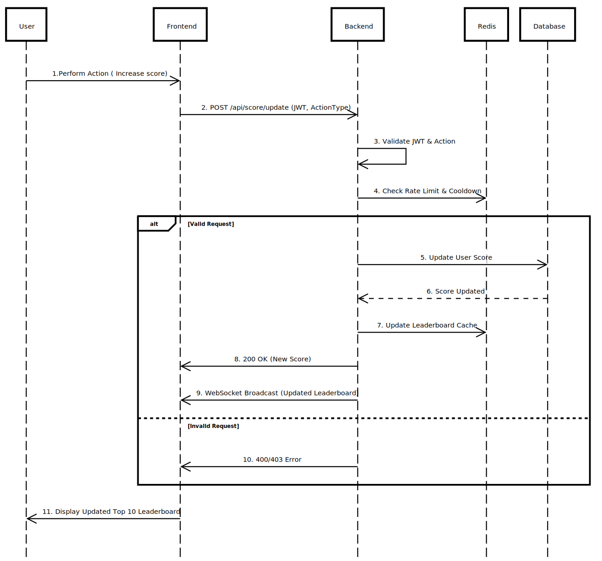

# Scoreboard System - Technical Documentation

## Overview

This document outlines the implementation details of a real-time scoreboard system, ensuring live updates and security measures to prevent unauthorized score manipulation.

## Technology Stack

- **Backend**: Node.js, Express.js
- **Database**: PostgreSQL
- **Cache & Leaderboard**: Redis (Sorted Sets)
- **Real-Time Communication**: WebSockets (with Redis Pub/Sub)
- **Authentication**: JWT, OAuth 2.0
- **Monitoring & Security**: Prometheus, Grafana, HMAC Signatures, Rate Limiting

## System Architecture

```
+------------+        +-------------+        +------------+
|  Frontend  | <--->  |  WebSocket  | <--->  |  Backend   |
+------------+        +-------------+        +------------+
                               |                  |
                           +--------+       +------------+
                           | Redis  | <-->  | PostgreSQL |
                           +--------+       +------------+
```

## Requirements

1. **Scoreboard displays the top 10 user scores.**
2. **Scores update in real-time.**
3. **Users increase their score by performing predefined actions.**
4. **The system updates scores via an API request upon action completion.**
5. **Security measures prevent score manipulation.**

---

## Architecture & Implementation

### 1. Real-Time Scoreboard Updates

To ensure real-time updates, we will use **WebSockets**:

- **Frontend**: Listens for score updates via WebSockets.
- **Backend**: Broadcasts updated scores using WebSockets.
- **Scalability**: Redis Pub/Sub is used to synchronize WebSocket messages across multiple instances.

**Alternative Approaches:**

- **Server-Sent Events (SSE)**: For one-way communication.
- **Polling (Fallback)**: Periodic polling (less efficient but works as a backup).

### 2. API for Score Updates

Users perform an action, which triggers an API request to update the score. The backend validates the request and updates the score in the database.

**API Endpoint Example:**

```http
POST /api/score/update
Headers:
   Authorization: Bearer <JWT_TOKEN>
Body:
   {
      "userId": "string",
      "score": "integer"
   }
```

#### **Backend Processing:**

1. **Verify JWT authentication.**
2. **Validate `actionType`** (e.g., `game_win`, `bonus_event`).
3. **Compute new score on server**, avoiding client-side score tampering.
4. **Apply rate limiting & cooldowns** to prevent abuse.
5. **Store new score in PostgreSQL & update Redis cache.**
6. **Broadcast updated leaderboard via WebSockets.**

## **Response:**

- `200 OK` - Score updated successfully.
- `400 Bad Request` - Invalid request data.
- `401 Unauthorized` - Authentication required.
- `403 Forbidden` - Unauthorized score update attempt.

### 3. Retrieve Top 10 Scores

**Endpoint:** `GET /api/score/top`

```http
GET /api/score/top
```

**Description:** Fetches the top 10 users with the highest scores.

**Response:**

```json
{
  "topScores": [
    {
      "userId": "string",
      "score": "integer"
    }
  ]
}
```

---

## Security Measures Against Fraudulent Score Manipulation

## Security Measures

### 1. Authentication & Authorization

- **JWT Authentication:** Verifies user identity.
- **OAuth 2.0 Support:** For third-party authentication.
- **HMAC Signature:** Protects request integrity.

### 2. Anti-Fraud & Rate Limiting

- **Replay Attack Prevention:** Requests must include a timestamp + nonce.
- **Rate Limiting:** Max **5 score updates per minute** per user.
- **IP Throttling:** Blocks excessive requests.
- **Action Cooldown:** Users must wait before sending another update.

### 3. Data Validation & Anomaly Detection

- **Server-Side Score Calculation:** Clients send actions, not scores.
- **Score Threshold Checks:** Prevent unrealistic jumps (e.g., +1000 points in 1 sec).
- **Behavioral Monitoring:** Detects unusual score patterns.

### 4. Action Verification Mechanisms

- **Server-Side Event Validation:** Ensures legitimate actions trigger score updates.
- **Proof-of-Work (PoW):** Computational challenge for high-frequency requests.
- **CAPTCHA Challenges:** Adds an extra layer of protection.

---

## Database & Leaderboard Optimization

### **Redis for Real-Time Leaderboard**

- **Store top 10 scores using Redis Sorted Sets Fast retrieval of the top 10 scores.**
- **Efficient ranking queries with O(log N) insert & O(10) retrieval.**
- **Background sync with PostgreSQL to ensure consistency.**

### **Batch Processing for Score Updates**

- **Queue-based processing (RabbitMQ) for high-traffic handling.**
- **Async updates to prevent API lag.**

---

## Execution Flow Diagram



## Improvement Recommendations

1. **Caching Layer:** Add Redis caching for leaderboard data to reduce database load.
2. **Enhanced Fraud Detection:** Implement machine learning model to detect abnormal score patterns.
3. **Database Optimization:** Use PostgreSQL window functions for efficient ranking queries.
4. **Request Tracing:** Add distributed tracing IDs for audit logging.
5. **Async Processing:** Use message queue (RabbitMQ) for non-critical update tasks.
6. **Load Testing:** Include locust.io load test scenarios for spike testing.

## **Implementation Notes for Engineering Team**

1. Use **idempotency keys** for score update requests to prevent duplicate processing.
2. Implement **circuit breakers** for Auth Service communication.
3. **Database transactions** MUST be used for score updates and leaderboard fetch.
4. WebSocket messages should use **protocol buffers** for efficient serialization.
5. All security checks must be **fail-closed** (reject on error).
6. Include Prometheus metrics for:
   - Score update attempts (success/fraudulent)
   - Leaderboard refresh latency
   - WebSocket connection health

This document serves as a blueprint for the backend engineering team to implement the API module efficiently and securely.
