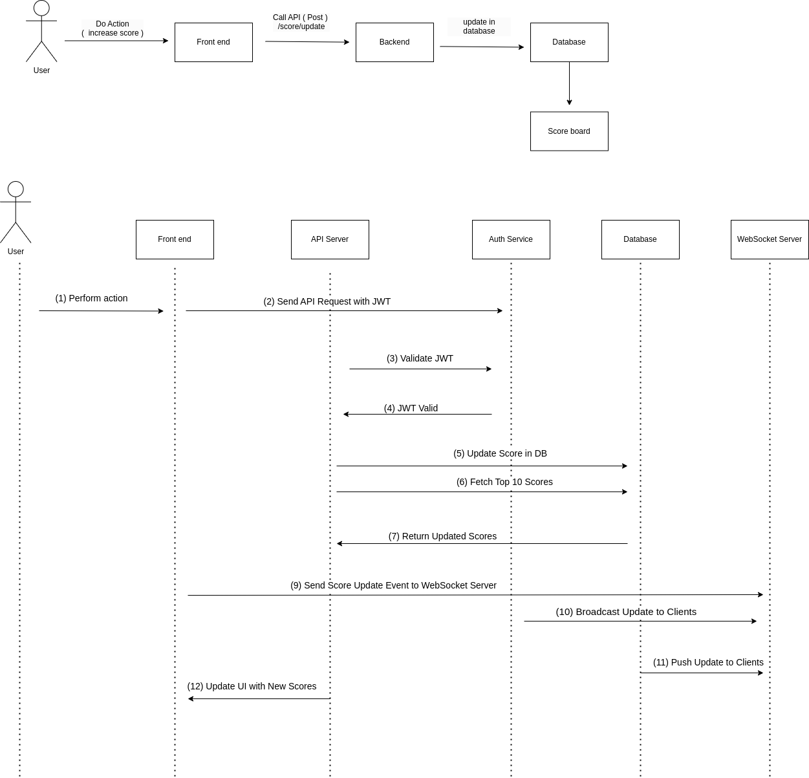

# **Scoreboard System - Technical Documentation**

## **Overview**

This document outlines the implementation details of a real-time scoreboard system, ensuring live updates and security measures to prevent unauthorized score manipulation.

## **Requirements**

1. The system displays a scoreboard with the **top 10 user scores**.
2. Scores should be **updated in real-time**.
3. Users increase their score by performing a predefined action.
4. The system receives an API request upon action completion to update the score.
5. Security mechanisms must be in place to prevent score manipulation.

---

## **Architecture & Implementation**

### **1. Real-Time Scoreboard Updates**

To ensure real-time updates, we will use **WebSockets**:

- **Frontend:** Listens to score updates from the server via WebSockets.
- **Backend:** Broadcasts updated scores to all connected clients when a user’s score changes.

**Alternative Approaches:**

- **Server-Sent Events (SSE):** If only one-way communication from the server to the client is needed.
- **Polling (Fallback):** If WebSockets are unavailable, periodic polling can be used (not recommended for scalability).

### **2. API for Score Updates**

Users perform an action, which triggers an API request to update the score. The backend validates the request and updates the score in the database.

**API Endpoint Example:**

```http
POST /api/score/update
Headers:
  Authorization: Bearer <JWT_TOKEN>
Body:
  {
    "userId": "string",
    "score": "integer"
  }
```

**Response:**

- `200 OK` - Score updated successfully.
- `400 Bad Request` - Invalid request data.
- `401 Unauthorized` - Authentication required.
- `403 Forbidden` - Unauthorized score update attempt.

### **3. Retrieve Top 10 Scores**

**Endpoint:** `GET /api/score/top`

**Description:** Fetches the top 10 users with the highest scores.

**Response:**

```json
{
  "topScores": [
    {
      "userId": "string",
      "score": "integer"
    }
  ]
}
```

---

## **Security Measures Against Fraudulent Score Manipulation**

### **1. Authentication & Authorization**

- **JWT Authentication:** API requests must include a valid JWT token to verify the user.
- **OAuth 2.0 Support:** For third-party authentication integrations.
- **API Key or HMAC Signature:** Additional security layer to verify request authenticity.

### **2. Rate Limiting & Anti-Spam Measures**

- **Rate Limiting:** Limit the number of score update requests per user/IP.
- **Throttling:** Apply incremental backoff delays on excessive requests.
- **Action Cooldown:** Introduce a cooldown period before allowing another score update.

### **3. Data Validation & Anomaly Detection**

- **Server-Side Validation:** The server determines the score increment instead of trusting client data.
- **Score Threshold Checks:** Reject unrealistic increments (e.g., +1000 points in 1 second).
- **HMAC Signature Verification:** Prevent tampering with request payloads.

### **4. Fraud Detection & Monitoring**

- **Behavioral Analysis:** Monitor score update patterns and flag anomalies.
- **Logging & Auditing:** Maintain logs for suspicious activity review.
- **IP/User Blacklisting:** Block users or IPs that exhibit malicious behavior.

### **5. Action Verification Mechanism**

- **Server-Side Event Validation:** Ensure score increments are triggered by a legitimate server-side event.
- **CAPTCHA Challenges:** Require CAPTCHA verification for high-frequency requests.
- **Proof-of-Work (PoW):** Introduce computational challenges to prevent automated abuse.

---

## **Database & Leaderboard Optimization**

- **Use Redis for Caching:** Fast retrieval of the top 10 scores.
- **Indexed Queries:** Optimize database queries for ranking calculations.
- **Eventual Consistency:** Use a combination of in-memory storage and persistent database updates.

---

## **Execution Flow Diagram**

```

```

## \*\*Improvement Recommendations

1. Caching Layer
   Add Redis caching for leaderboard data to reduce database load

2. Enhanced Fraud Detection
   Implement machine learning model to detect abnormal score patterns

3. Database Optimization
   Use PostgreSQL window functions for efficient ranking queries

4. Request Tracing
   Add distributed tracing IDs for audit logging

5. Async Processing
   Use message queue (RabbitMQ) for non-critical update tasks

6. Load Testing
   Include locust.io load test scenarios for spike testing

**Implementation Notes for Engineering Team**

1. Use **idempotency keys** for score update requests to prevent duplicate processing
2. Implement **circuit breakers** for Auth Service communication
3. **Database transactions** MUST be used for score updates+leaderboard fetch
4. WebSocket messages should use **protocol buffers** for efficient serialization
5. All security checks must be **fail-closed** (reject on error)
6. Include Prometheus metrics for:
   - Score update attempts (success/fraudulent)
   - Leaderboard refresh latency
   - WebSocket connection health

This document serves as a blueprint for the backend engineering team to implement the API module efficiently and securely.
